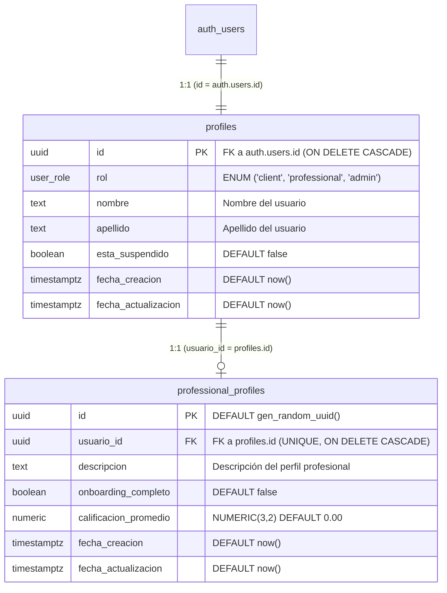

# Reporte de Especificación Backend - Argendar (EP-AUTH)

**Proyecto:** Argendar — Plataforma Integrada de Servicios Técnicos  
**Épica:** Registro y Autenticación (`EP-AUTH`)  
**Historias de Usuario Cubiertas:** `HU-01`, `HU-02`, `HU-03`, `HU-04`, `HU-05`  
**Destinatarios:** Equipo de Frontend (React JS), Arquitectura y QA  
**Fecha:** Agosto 2026  
**Versión:** 1.2.0 — Esquema Unificado en Español y Optimizado  

---

## 1. Resumen Ejecutivo y Alcance

El presente documento detalla la arquitectura, persistencia unificada en Supabase PostgreSQL, especificación de la API REST y mecanismos de seguridad desarrollados para el módulo de **Registro y Autenticación (`EP-AUTH`)**, con todas las columnas de base de datos estandarizadas en **idioma español**.

### 🎯 Unificación de Tablas y Columnas en Español
Se ha consolidado el modelo de persistencia eliminando la tabla prototipo `usuarios` y unificando el 100% de los datos de identidad y perfil en la tabla canónica **`public.profiles`** (vinculada 1:1 con `auth.users(id)` de Supabase Auth) y **`public.professional_profiles`**.

Beneficios:
* **Cero redundancia y nomenclatura uniforme:** Todas las columnas de persistencia siguen la convención en español (`rol`, `nombre`, `apellido`, `esta_suspendido`, `usuario_id`, `onboarding_completo`, `calificacion_promedio`, `fecha_creacion`, `fecha_actualizacion`).
* **Consultas optimizadas mediante índices B-Tree:** Tiempos de respuesta $O(1)$ y $O(\log n)$ en validaciones de autenticación, filtrado de roles y búsquedas en el marketplace.
* **Integridad referencial y RLS nativo:** Toda la seguridad de filas se ejecuta en la capa de persistencia mediante políticas PostgreSQL.

---

## 2. Esquema Final de Base de Datos (Supabase PostgreSQL)



### Script DDL de Migración Optimizado (`01_create_ep_auth_tables.sql`)

```sql
-- 0. Limpieza de tabla obsoleta/redundante
DROP TABLE IF EXISTS public.usuarios CASCADE;

-- 1. Tipo ENUM para roles
DO $$
BEGIN
    IF NOT EXISTS (SELECT 1 FROM pg_type WHERE typname = 'user_role') THEN
        CREATE TYPE user_role AS ENUM ('client', 'professional', 'admin');
    END IF;
END$$;

-- 2. Función trigger para actualizar fecha_actualizacion
CREATE OR REPLACE FUNCTION public.handle_updated_at()
RETURNS TRIGGER AS $$
BEGIN
    NEW.fecha_actualizacion = timezone('utc'::text, now());
    RETURN NEW;
END;
$$ LANGUAGE plpgsql;

-- 3. Tabla public.profiles
CREATE TABLE IF NOT EXISTS public.profiles (
    id UUID PRIMARY KEY REFERENCES auth.users(id) ON DELETE CASCADE,
    rol user_role NOT NULL DEFAULT 'client',
    nombre TEXT NOT NULL,
    apellido TEXT NOT NULL,
    esta_suspendido BOOLEAN NOT NULL DEFAULT false,
    fecha_creacion TIMESTAMPTZ NOT NULL DEFAULT timezone('utc'::text, now()),
    fecha_actualizacion TIMESTAMPTZ NOT NULL DEFAULT timezone('utc'::text, now())
);

-- Índices de alto rendimiento en profiles
CREATE INDEX IF NOT EXISTS idx_profiles_rol ON public.profiles(rol);
CREATE INDEX IF NOT EXISTS idx_profiles_esta_suspendido ON public.profiles(esta_suspendido);
CREATE INDEX IF NOT EXISTS idx_profiles_rol_suspendido ON public.profiles(rol, esta_suspendido);
CREATE INDEX IF NOT EXISTS idx_profiles_fecha_creacion ON public.profiles(fecha_creacion DESC);

CREATE TRIGGER tr_profiles_updated_at
    BEFORE UPDATE ON public.profiles
    FOR EACH ROW
    EXECUTE FUNCTION public.handle_updated_at();

-- 4. Tabla public.professional_profiles
CREATE TABLE IF NOT EXISTS public.professional_profiles (
    id UUID PRIMARY KEY DEFAULT gen_random_uuid(),
    usuario_id UUID NOT NULL UNIQUE REFERENCES public.profiles(id) ON DELETE CASCADE,
    descripcion TEXT,
    onboarding_completo BOOLEAN NOT NULL DEFAULT false,
    calificacion_promedio NUMERIC(3,2) NOT NULL DEFAULT 0.00 CHECK (calificacion_promedio >= 0 AND calificacion_promedio <= 5),
    fecha_creacion TIMESTAMPTZ NOT NULL DEFAULT timezone('utc'::text, now()),
    fecha_actualizacion TIMESTAMPTZ NOT NULL DEFAULT timezone('utc'::text, now())
);

-- Índices de alto rendimiento en professional_profiles
CREATE INDEX IF NOT EXISTS idx_professional_profiles_usuario_id ON public.professional_profiles(usuario_id);
CREATE INDEX IF NOT EXISTS idx_professional_profiles_onboarding ON public.professional_profiles(onboarding_completo);
CREATE INDEX IF NOT EXISTS idx_professional_profiles_calificacion ON public.professional_profiles(calificacion_promedio DESC);

CREATE TRIGGER tr_prof_profiles_updated_at
    BEFORE UPDATE ON public.professional_profiles
    FOR EACH ROW
    EXECUTE FUNCTION public.handle_updated_at();
```

---

## 3. Políticas de Seguridad RLS (Row Level Security)

```sql
-- Habilitación de RLS
ALTER TABLE public.profiles ENABLE ROW LEVEL SECURITY;
ALTER TABLE public.professional_profiles ENABLE ROW LEVEL SECURITY;

-- Políticas para profiles
CREATE POLICY "Users can read own profile"
    ON public.profiles FOR SELECT TO authenticated
    USING (auth.uid() = id);

CREATE POLICY "Users can update own profile"
    ON public.profiles FOR UPDATE TO authenticated
    USING (auth.uid() = id)
    WITH CHECK (auth.uid() = id);

CREATE POLICY "Users can insert own profile"
    ON public.profiles FOR INSERT TO authenticated
    WITH CHECK (auth.uid() = id);

-- Políticas para professional_profiles
CREATE POLICY "Professionals or public can view professional profiles"
    ON public.professional_profiles FOR SELECT TO authenticated
    USING (auth.uid() = usuario_id OR onboarding_completo = true);

CREATE POLICY "Professionals can update own professional profile"
    ON public.professional_profiles FOR UPDATE TO authenticated
    USING (auth.uid() = usuario_id)
    WITH CHECK (auth.uid() = usuario_id);

CREATE POLICY "Professionals can insert own professional profile"
    ON public.professional_profiles FOR INSERT TO authenticated
    WITH CHECK (auth.uid() = usuario_id);
```

---

## 4. Especificación Técnica de la API REST

**Base URL:** `http://localhost:5000/api/v1`

### 4.1. Registro de Usuario (`HU-01` y `HU-02`)

* **Ruta:** `POST /api/v1/auth/register`
* **Acceso:** Público (Protegido con Rate Limiting: 30 peticiones / 15 min).
* **Headers:** `Content-Type: application/json`

#### Request Body:
```json
{
  "email": "carlos.paz@example.com",
  "password": "Password123",
  "first_name": "Carlos",
  "last_name": "Paz",
  "role": "client"
}
```

#### Respuestas:
* **`201 Created`:** Retorna usuario y tokens JWT de sesión.
* **`400 Bad Request`:** Errores de validación de formato.
* **`409 Conflict`:** *"Este correo ya está registrado en Argendar"*.

---

### 4.2. Inicio de Sesión (`HU-03` y `HU-05`)

* **Ruta:** `POST /api/v1/auth/login`
* **Acceso:** Público (Protegido con Rate Limiting).
* **Headers:** `Content-Type: application/json`

#### Request Body:
```json
{
  "email": "mario.profesional@example.com",
  "password": "Password123"
}
```

#### Respuestas:
* **`200 OK`:** Retorna JWT y perfil con `role` e `is_onboarding_complete` para redirección inmediata.
* **`401 Unauthorized`:** *"Correo o contraseña incorrectos"*.
* **`403 Forbidden`:** *"Tu cuenta se encuentra suspendida. Contactá a soporte"*.

---

### 4.3. Recuperación de Contraseña (`HU-04`)

* **Ruta:** `POST /api/v1/auth/recover-password`
* **Headers:** `Content-Type: application/json`
* **Request Body:** `{ "email": "usuario@example.com" }`
* **`200 OK`:** *"Si el correo electrónico está registrado en Argendar, recibirás un enlace para restablecer tu contraseña."*

---

### 4.4. Perfil del Usuario Autenticado (`HU-05`)

* **Ruta:** `GET /api/v1/auth/me`
* **Headers:** `Authorization: Bearer <access_token>`
* **`200 OK`:** Datos completos del perfil y rol.

---

## 5. Middlewares de Seguridad

* **`authMiddleware`**: Verifica JWT, decodifica sesión y valida `esta_suspendido = false`.
* **`requireRole(...roles)`**: Restringe accesos por rol (`'client'`, `'professional'`, `'admin'`).
* **`requireOnboardingComplete`**: Intercepta rutas de profesionales y bloquea con `403` (`code: ONBOARDING_INCOMPLETE`) si `onboarding_completo` no es `true`.
* **`authRateLimiter`**: Control de tasa (30 peticiones / 15 min).

---

## 6. Verificación de Pruebas Automatizadas

* **Resultados:** `33/33 tests pasando exitosamente (100% de éxito)`.
