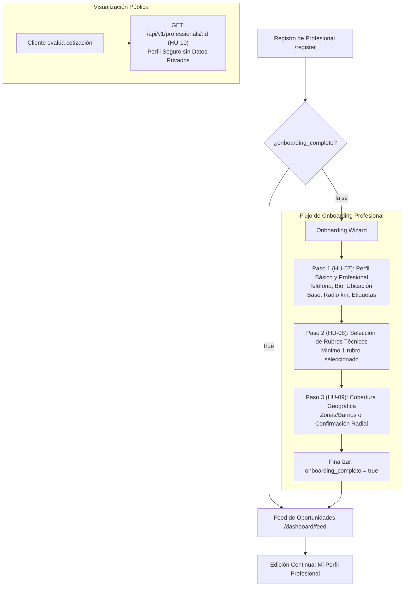
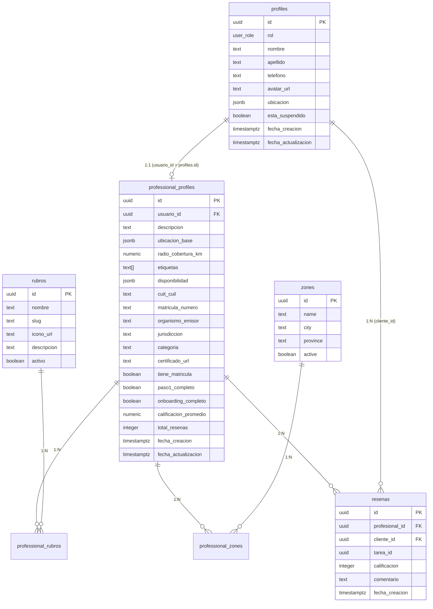

# Reporte de Especificación Técnica Actualizado — Módulo Perfil Profesional, Onboarding y Cobertura Geográfica

**Proyecto:** Argendar — Plataforma Integrada de Servicios Técnicos  
**Módulo:** Perfil Profesional, Onboarding Multi-Paso, Cobertura Geográfica (Zonas y Radial Geodésico)  
**Historias de Usuario Cubiertas:** `HU-07`, `HU-08`, `HU-09`, `HU-10` (con soporte transversal para `HU-02` y `HU-11`)  
**Roles Involucrados:** Profesional de Servicios Técnicos (Administración) / Cliente (Visualización Pública y Contratación)  
**Alcance Geográfico:** Ciudad Autónoma de Buenos Aires (CABA) y Provincia de Buenos Aires (PBA)  
**Versión:** 3.1.0 — Especificación Técnica Backend y Persistencia en Supabase  

---

## 1. Resumen Ejecutivo y Arquitectura del Módulo

El **Módulo de Perfil Profesional y Onboarding** de Argendar proporciona los mecanismos para que los profesionales técnicos completen su información de contacto, definan sus habilidades y especialidades, configuren su disponibilidad horaria, declaren sus credenciales y matrículas habilitantes, y establezcan su área de atención geográfica (tanto mediante selección de zonas/barrios como por radio geodésico sobre Google Maps).

### 🚀 Principales Componentes y Decisiones Técnicas:
1. **Perfil Básico y Profesional Segmentado:**
   - `public.profiles`: Información general del usuario (`nombre`, `apellido`, `telefono`, `avatar_url`, `ubicacion`).
   - `public.professional_profiles`: Información técnico-laboral (`descripcion`, `ubicacion_base`, `radio_cobertura_km`, `etiquetas`, `disponibilidad`, `cuit_cuil`, `matricula_numero`, `organismo_emisor`, `jurisdiccion`, `categoria`, `certificado_url`, `tiene_matricula`, `paso1_completo`, `onboarding_completo`, `calificacion_promedio`, `total_resenas`).
2. **Doble Mecanismo de Cobertura Geográfica:**
   - **Por Zonas/Barrios (`HU-09`):** Selección de zonas predefinidas en la tabla `zones` vinculadas en `professional_zones`.
   - **Por Radio Geodésico Google Maps:** Punto central (`latitud`, `longitud`) con un radio de cobertura en kilómetros (`radio_cobertura_km` entre 1 y 50 km) evaluado mediante la función SQL `public.calcular_distancia_km` (Haversine).
3. **Estructura de Disponibilidad Horaria:**
   - Estructura estructurada JSONB que contempla los 7 días de la semana (`lunes` a `domingo`) con estado activo y rangos horarios (`desde`, `hasta`), o configuración de jornada laboral unificada con notas adicionales.
4. **Matrícula y Credenciales Habilitantes:**
   - Declaración de CUIT/CUIL validado, número de matrícula, organismo emisor (ej. *COPIME, ENARGAS, Colegio de Técnicos*), jurisdicción y categoría, con subida opcional de certificado a Supabase Storage (Bucket privado `certificados`).
   - Activación automática de `tiene_matricula = true` al completar número y organismo.
5. **Etiquetas de Especialidad (Tags):**
   - Campo `etiquetas TEXT[]` para búsqueda y categorización por especialidades concretas (ej. `["Inverter", "Matriculado", "Instalaciones Comerciales", "Urgencias 24hs"]`).
6. **Sistema de Reputación y Reseñas:**
   - Tabla `resenas` con calificaciones de 1 a 5 estrellas, comentarios y vínculo con la tarea realizada (`tarea_id`).
   - Actualización automática del promedio de estrellas (`calificacion_promedio`) y conteo (`total_resenas`).
7. **Privacidad Estricta en Perfil Público (`HU-10`):**
   - La consulta pública (`GET /api/v1/professionals/:id`) omite rigurosamente datos de contacto privados (teléfono, correo electrónico, DNI, CUIT y dirección exacta).

---

## 2. Flujo de Navegación y Ciclo de Vida del Onboarding



---

## 3. Integración con Google Maps API y Ubicación Geográfica

### 3.1 Restricción Operativa (CABA y PBA)
El backend y frontend restringen y validan las coordenadas dentro de los límites geográficos de operación:
```javascript
export const BOUNDS_OPERATIVOS = {
  lat_min: -40.5,  // Límite sur PBA
  lat_max: -33.0,  // Límite norte PBA
  lng_min: -63.5,  // Límite oeste PBA
  lng_max: -56.5   // Límite este PBA (Costa / Delta)
};

export const validarCoordenadasBuenosAires = (latitud, longitud) => {
  if (latitud == null || longitud == null) return false;
  const lat = Number(latitud);
  const lng = Number(longitud);
  if (isNaN(lat) || isNaN(lng)) return false;
  return lat >= BOUNDS_OPERATIVOS.lat_min &&
         lat <= BOUNDS_OPERATIVOS.lat_max &&
         lng >= BOUNDS_OPERATIVOS.lng_min &&
         lng <= BOUNDS_OPERATIVOS.lng_max;
};
```

### 3.2 Objeto JSON de Ubicación Base (`ubicacion_base` / `ubicacion`):
```json
{
  "direccion_formateada": "Av. Rivadavia 5000, Caballito, C1405 CABA, Argentina",
  "calle": "Avenida Rivadavia",
  "altura": "5000",
  "barrio_localidad": "Caballito",
  "partido_municipio": "Comuna 6",
  "provincia": "Ciudad Autónoma de Buenos Aires",
  "pais": "Argentina",
  "codigo_postal": "C1405",
  "latitud": -34.618523,
  "longitud": -58.436789,
  "place_id": "ChIJA0..."
}
```

---

## 4. Estructuras de Datos Específicas

### 4.1 Estructura de Disponibilidad Horaria (`disponibilidad` JSONB)
Permite configurar el esquema semanal detallado o la modalidad unificada:
```json
{
  "tipo": "semanal",
  "dias": {
    "lunes": { "activo": true, "desde": "08:00", "hasta": "18:00" },
    "martes": { "activo": true, "desde": "08:00", "hasta": "18:00" },
    "miercoles": { "activo": true, "desde": "08:00", "hasta": "18:00" },
    "jueves": { "activo": true, "desde": "08:00", "hasta": "18:00" },
    "viernes": { "activo": true, "desde": "08:00", "hasta": "18:00" },
    "sabado": { "activo": true, "desde": "09:00", "hasta": "13:00" },
    "domingo": { "activo": false, "desde": "", "hasta": "" }
  },
  "guardia_urgencias": false,
  "nota": "Atención con turno previo"
}
```

### 4.2 Información de Matrícula Profesional
```json
{
  "cuit_cuil": "20-35123456-9",
  "matricula_numero": "MAT-ELEC-4892",
  "organismo_emisor": "COPIME",
  "jurisdiccion": "CABA",
  "categoria": "1ra Categoría",
  "certificado_url": "https://supabase.co/storage/v1/object/authenticated/certificados/cert_35123456.pdf",
  "tiene_matricula": true
}
```

### 4.3 Etiquetas / Tags de Especialidad
Array de textos normalizados:
```json
["Electricista", "Matriculado", "Instalaciones Comerciales", "Trifásica", "Tableros Eléctricos"]
```

---

## 5. Contratos de la API REST

### 5.1 Actualizar Perfil Básico de Usuario (`HU-07`)
* **Método:** `PUT`
* **Ruta:** `/api/v1/profile`
* **Headers:** `Authorization: Bearer <jwt>`, `Content-Type: application/json`

#### Request Body:
```json
{
  "nombre": "Esteban",
  "apellido": "Morales",
  "telefono": "+54 9 11 4567-8901",
  "avatar_url": "https://supabase.co/storage/v1/object/public/avatares/esteban.jpg",
  "ubicacion": {
    "direccion_formateada": "Av. Rivadavia 5000, Caballito, CABA",
    "barrio_localidad": "Caballito",
    "latitud": -34.618523,
    "longitud": -58.436789
  }
}
```

#### Response `200 OK`:
```json
{
  "status": "success",
  "message": "Perfil de usuario actualizado exitosamente.",
  "data": {
    "id": "cec390c9-9c3d-4a28-9b83-8a12994a1b54",
    "nombre": "Esteban",
    "apellido": "Morales",
    "telefono": "+54 9 11 4567-8901",
    "avatar_url": "https://supabase.co/storage/v1/object/public/avatares/esteban.jpg"
  }
}
```

---

### 5.2 Actualizar Perfil Profesional (`HU-07`)
* **Método:** `PUT`
* **Ruta:** `/api/v1/professional-profile`
* **Headers:** `Authorization: Bearer <jwt>`, `Content-Type: application/json`

#### Request Body:
```json
{
  "descripcion": "Técnico Electricista Matriculado con más de 10 años de experiencia en instalaciones domiciliarias y comerciales.",
  "ubicacion_base": {
    "direccion_formateada": "Av. Rivadavia 5000, Caballito, CABA",
    "calle": "Avenida Rivadavia",
    "altura": "5000",
    "barrio_localidad": "Caballito",
    "partido_municipio": "Comuna 6",
    "provincia": "Ciudad Autónoma de Buenos Aires",
    "latitud": -34.618523,
    "longitud": -58.436789
  },
  "radio_cobertura_km": 15,
  "etiquetas": ["Electricista", "Matriculado", "Trifásica", "Tableros"],
  "disponibilidad": {
    "dias": {
      "lunes": { "activo": true, "desde": "08:00", "hasta": "18:00" },
      "martes": { "activo": true, "desde": "08:00", "hasta": "18:00" },
      "miercoles": { "activo": true, "desde": "08:00", "hasta": "18:00" },
      "jueves": { "activo": true, "desde": "08:00", "hasta": "18:00" },
      "viernes": { "activo": true, "desde": "08:00", "hasta": "18:00" },
      "sabado": { "activo": true, "desde": "09:00", "hasta": "13:00" },
      "domingo": { "activo": false, "desde": "", "hasta": "" }
    }
  },
  "cuit_cuil": "20-35123456-9",
  "matricula_numero": "MAT-ELEC-4892",
  "organismo_emisor": "COPIME",
  "jurisdiccion": "CABA",
  "categoria": "1ra Categoría",
  "certificado_url": "https://supabase.co/.../cert.pdf"
}
```

#### Response `200 OK`:
```json
{
  "status": "success",
  "message": "Perfil profesional actualizado exitosamente.",
  "data": {
    "id": "7b8f9e1a-2c3d-4e5f-a6b7-c8d9e0f1a2b3",
    "usuario_id": "cec390c9-9c3d-4a28-9b83-8a12994a1b54",
    "descripcion": "Técnico Electricista Matriculado...",
    "radio_cobertura_km": 15,
    "tiene_matricula": true,
    "paso1_completo": true,
    "onboarding_completo": false
  }
}
```

---

### 5.3 Obtener Lista de Rubros Habilitados (`HU-08`)
* **Método:** `GET`
* **Ruta:** `/api/v1/rubros`
* **Response `200 OK`:**
```json
{
  "status": "success",
  "data": [
    {
      "id": "b1a2c3d4-e5f6-7a8b-9c0d-1e2f3a4b5c6d",
      "nombre": "Electricista",
      "slug": "electricista",
      "icono_url": "https://argendar.com/icons/electricista.svg",
      "descripcion": "Instalaciones eléctricas residenciales y comerciales, tableros y mantenimiento",
      "activo": true
    },
    {
      "id": "c2b3a4d5-e6f7-8a9b-0c1d-2e3f4a5b6c7d",
      "nombre": "Plomero",
      "slug": "plomero",
      "icono_url": "https://argendar.com/icons/plomero.svg",
      "descripcion": "Cañerías, sanitarios, destapaciones e instalaciones de gas",
      "activo": true
    },
    {
      "id": "d3c4b5a6-e7f8-9a0b-1c2d-3e4f5a6b7c8d",
      "nombre": "Frigorista",
      "slug": "frigorista",
      "icono_url": "https://argendar.com/icons/frigorista.svg",
      "descripcion": "Instalación, mantenimiento y reparación de aire acondicionado y refrigeración",
      "activo": true
    }
  ]
}
```

---

### 5.4 Asignar Rubros al Perfil Profesional (`HU-08`)
* **Método:** `PUT`
* **Ruta:** `/api/v1/professional-profile/rubros`
* **Headers:** `Authorization: Bearer <jwt>`, `Content-Type: application/json`

#### Request Body:
```json
{
  "rubro_ids": [
    "b1a2c3d4-e5f6-7a8b-9c0d-1e2f3a4b5c6d",
    "d3c4b5a6-e7f8-9a0b-1c2d-3e4f5a6b7c8d"
  ]
}
```

#### Response `200 OK`:
```json
{
  "status": "success",
  "message": "Rubros actualizados exitosamente.",
  "data": {
    "rubros_asignados": 2
  }
}
```

---

### 5.5 Obtener Lista de Zonas Habilitadas (`HU-09`)
* **Método:** `GET`
* **Ruta:** `/api/v1/zones`
* **Response `200 OK`:**
```json
{
  "status": "success",
  "data": [
    { "id": "z1-uuid", "name": "Caballito", "city": "CABA", "province": "Ciudad Autónoma de Buenos Aires" },
    { "id": "z2-uuid", "name": "Palermo", "city": "CABA", "province": "Ciudad Autónoma de Buenos Aires" },
    { "id": "z3-uuid", "name": "Vicente López", "city": "GBA Norte", "province": "Buenos Aires" }
  ]
}
```

---

### 5.6 Asignar Zonas y Finalizar Onboarding (`HU-09`)
* **Método:** `PUT`
* **Ruta:** `/api/v1/professional-profile/zones`
* **Headers:** `Authorization: Bearer <jwt>`, `Content-Type: application/json`

#### Request Body:
```json
{
  "zone_ids": [
    "z1-uuid",
    "z2-uuid"
  ],
  "finalizar_onboarding": true
}
```

#### Response `200 OK`:
```json
{
  "status": "success",
  "message": "Zonas de cobertura actualizadas y onboarding completado exitosamente.",
  "data": {
    "zonas_asignadas": 2,
    "onboarding_completo": true,
    "redirect_url": "/dashboard/feed"
  }
}
```

---

### 5.7 Visualización Pública del Perfil Profesional (`HU-10`)
* **Método:** `GET`
* **Ruta:** `/api/v1/professionals/:id`
* **Acceso:** Usuarios autenticados (clientes y profesionales)

#### Response `200 OK` (JOIN Seguro sin Datos Privados):
```json
{
  "status": "success",
  "data": {
    "id": "7b8f9e1a-2c3d-4e5f-a6b7-c8d9e0f1a2b3",
    "nombre": "Esteban",
    "apellido_inicial": "M.",
    "avatar_url": "https://supabase.co/.../esteban.jpg",
    "descripcion": "Técnico Electricista Matriculado con más de 10 años de experiencia...",
    "calificacion_promedio": 4.90,
    "total_resenas": 28,
    "etiquetas": ["Electricista", "Matriculado", "Trifásica", "Tableros"],
    "ubicacion_referencial": {
      "barrio_localidad": "Caballito",
      "partido_municipio": "Comuna 6",
      "provincia": "Ciudad Autónoma de Buenos Aires"
    },
    "radio_cobertura_km": 15,
    "disponibilidad": {
      "dias": {
        "lunes": { "activo": true, "desde": "08:00", "hasta": "18:00" },
        "martes": { "activo": true, "desde": "08:00", "hasta": "18:00" }
      }
    },
    "matricula": {
      "tiene_matricula": true,
      "organismo_emisor": "COPIME",
      "jurisdiccion": "CABA",
      "categoria": "1ra Categoría"
    },
    "rubros": [
      { "id": "b1a2c3d4-...", "nombre": "Electricista", "slug": "electricista" }
    ],
    "zonas": [
      { "id": "z1-uuid", "name": "Caballito", "city": "CABA" }
    ],
    "resenas_recientes": [
      {
        "id": "res-1",
        "cliente_nombre": "Sofía M.",
        "calificacion": 5,
        "comentario": "Excelente trabajo, muy puntual y prolijo.",
        "fecha": "2026-07-28T14:30:00Z"
      }
    ]
  }
}
```

> [!CAUTION]
> **Campos Estrictamente Omitidos:** `telefono`, `email`, `dni`, `cuit_cuil`, `certificado_url`, `detalles_direccion`, `latitud` y `longitud` exactas.

---

## 6. Esquema de Base de Datos y Script DDL de Migración



### Script DDL Oficial (`02_create_professional_profile_and_location.sql`)

```sql
-- ============================================================================
-- MIGRACIÓN 02: Perfil Profesional, Ubicación Google Maps, Zonas, Rubros y Reseñas
-- Proyecto: Argendar
-- ============================================================================

-- 1. Ampliar tabla public.profiles
ALTER TABLE public.profiles
    ADD COLUMN IF NOT EXISTS telefono TEXT,
    ADD COLUMN IF NOT EXISTS avatar_url TEXT,
    ADD COLUMN IF NOT EXISTS ubicacion JSONB;

-- 2. Ampliar tabla public.professional_profiles
ALTER TABLE public.professional_profiles
    ADD COLUMN IF NOT EXISTS ubicacion_base JSONB,
    ADD COLUMN IF NOT EXISTS radio_cobertura_km NUMERIC(5,2) NOT NULL DEFAULT 10.00,
    ADD COLUMN IF NOT EXISTS etiquetas TEXT[] DEFAULT '{}',
    ADD COLUMN IF NOT EXISTS disponibilidad JSONB DEFAULT '{}'::jsonb,
    ADD COLUMN IF NOT EXISTS cuit_cuil TEXT,
    ADD COLUMN IF NOT EXISTS matricula_numero TEXT,
    ADD COLUMN IF NOT EXISTS organismo_emisor TEXT,
    ADD COLUMN IF NOT EXISTS jurisdiccion TEXT,
    ADD COLUMN IF NOT EXISTS categoria TEXT,
    ADD COLUMN IF NOT EXISTS certificado_url TEXT,
    ADD COLUMN IF NOT EXISTS tiene_matricula BOOLEAN NOT NULL DEFAULT false,
    ADD COLUMN IF NOT EXISTS paso1_completo BOOLEAN NOT NULL DEFAULT false,
    ADD COLUMN IF NOT EXISTS total_resenas INTEGER NOT NULL DEFAULT 0;

-- Restricciones de integridad
ALTER TABLE public.professional_profiles
    DROP CONSTRAINT IF EXISTS chk_radio_cobertura;
ALTER TABLE public.professional_profiles
    ADD CONSTRAINT chk_radio_cobertura
    CHECK (radio_cobertura_km >= 1 AND radio_cobertura_km <= 50);

ALTER TABLE public.professional_profiles
    DROP CONSTRAINT IF EXISTS chk_descripcion_longitud;
ALTER TABLE public.professional_profiles
    ADD CONSTRAINT chk_descripcion_longitud
    CHECK (descripcion IS NULL OR char_length(descripcion) <= 500);

-- 3. Tabla de Rubros Técnicos
CREATE TABLE IF NOT EXISTS public.rubros (
    id UUID PRIMARY KEY DEFAULT gen_random_uuid(),
    nombre TEXT NOT NULL UNIQUE,
    slug TEXT NOT NULL UNIQUE,
    icono_url TEXT,
    descripcion TEXT,
    activo BOOLEAN NOT NULL DEFAULT true,
    fecha_creacion TIMESTAMPTZ NOT NULL DEFAULT timezone('utc'::text, now())
);

-- 4. Tabla Intermedia: professional_rubros
CREATE TABLE IF NOT EXISTS public.professional_rubros (
    id UUID PRIMARY KEY DEFAULT gen_random_uuid(),
    profesional_id UUID NOT NULL REFERENCES public.professional_profiles(id) ON DELETE CASCADE,
    rubro_id UUID NOT NULL REFERENCES public.rubros(id) ON DELETE CASCADE,
    fecha_creacion TIMESTAMPTZ NOT NULL DEFAULT timezone('utc'::text, now()),
    UNIQUE(profesional_id, rubro_id)
);

-- 5. Tabla de Zonas Geográficas (Barrios / Localidades)
CREATE TABLE IF NOT EXISTS public.zones (
    id UUID PRIMARY KEY DEFAULT gen_random_uuid(),
    name TEXT NOT NULL,
    city TEXT NOT NULL,
    province TEXT NOT NULL,
    active BOOLEAN NOT NULL DEFAULT true,
    fecha_creacion TIMESTAMPTZ NOT NULL DEFAULT timezone('utc'::text, now()),
    UNIQUE(name, city, province)
);

-- 6. Tabla Intermedia: professional_zones
CREATE TABLE IF NOT EXISTS public.professional_zones (
    id UUID PRIMARY KEY DEFAULT gen_random_uuid(),
    professional_id UUID NOT NULL REFERENCES public.professional_profiles(id) ON DELETE CASCADE,
    zone_id UUID NOT NULL REFERENCES public.zones(id) ON DELETE CASCADE,
    fecha_creacion TIMESTAMPTZ NOT NULL DEFAULT timezone('utc'::text, now()),
    UNIQUE(professional_id, zone_id)
);

-- 7. Tabla de Reseñas y Calificaciones
CREATE TABLE IF NOT EXISTS public.resenas (
    id UUID PRIMARY KEY DEFAULT gen_random_uuid(),
    profesional_id UUID NOT NULL REFERENCES public.professional_profiles(id) ON DELETE CASCADE,
    cliente_id UUID NOT NULL REFERENCES public.profiles(id) ON DELETE CASCADE,
    tarea_id UUID,
    calificacion INTEGER NOT NULL CHECK (calificacion >= 1 AND calificacion <= 5),
    comentario TEXT,
    fecha_creacion TIMESTAMPTZ NOT NULL DEFAULT timezone('utc'::text, now())
);

-- 8. Función SQL de Distancia Geodésica (Haversine)
CREATE OR REPLACE FUNCTION public.calcular_distancia_km(
    lat1 NUMERIC, lon1 NUMERIC,
    lat2 NUMERIC, lon2 NUMERIC
) RETURNS NUMERIC AS $$
DECLARE
    r CONSTANT NUMERIC := 6371;
    dlat NUMERIC;
    dlon NUMERIC;
    a NUMERIC;
    c NUMERIC;
BEGIN
    IF lat1 IS NULL OR lon1 IS NULL OR lat2 IS NULL OR lon2 IS NULL THEN
        RETURN NULL;
    END IF;
    dlat := radians(lat2 - lat1);
    dlon := radians(lon2 - lon1);
    a := sin(dlat/2)^2 + cos(radians(lat1)) * cos(radians(lat2)) * sin(dlon/2)^2;
    c := 2 * atan2(sqrt(a), sqrt(1 - a));
    RETURN ROUND((r * c)::numeric, 2);
END;
$$ LANGUAGE plpgsql IMMUTABLE;

-- 9. Índices de Rendimiento
CREATE INDEX IF NOT EXISTS idx_professional_rubros_prof ON public.professional_rubros(profesional_id);
CREATE INDEX IF NOT EXISTS idx_professional_rubros_rubro ON public.professional_rubros(rubro_id);
CREATE INDEX IF NOT EXISTS idx_professional_zones_prof ON public.professional_zones(professional_id);
CREATE INDEX IF NOT EXISTS idx_professional_zones_zone ON public.professional_zones(zone_id);
CREATE INDEX IF NOT EXISTS idx_resenas_profesional ON public.resenas(profesional_id);
CREATE INDEX IF NOT EXISTS idx_professional_profiles_onboarding ON public.professional_profiles(onboarding_completo);

-- 10. Políticas RLS (Row Level Security)
ALTER TABLE public.rubros ENABLE ROW LEVEL SECURITY;
ALTER TABLE public.zones ENABLE ROW LEVEL SECURITY;
ALTER TABLE public.professional_rubros ENABLE ROW LEVEL SECURITY;
ALTER TABLE public.professional_zones ENABLE ROW LEVEL SECURITY;
ALTER TABLE public.resenas ENABLE ROW LEVEL SECURITY;

CREATE POLICY "Rubros visibles para todos" ON public.rubros FOR SELECT TO authenticated, anon USING (true);
CREATE POLICY "Zones visibles para todos" ON public.zones FOR SELECT TO authenticated, anon USING (true);
CREATE POLICY "Professional rubros visibles" ON public.professional_rubros FOR SELECT TO authenticated, anon USING (true);
CREATE POLICY "Professional zones visibles" ON public.professional_zones FOR SELECT TO authenticated, anon USING (true);
CREATE POLICY "Resenas visibles para todos" ON public.resenas FOR SELECT TO authenticated, anon USING (true);

-- Modificación de rubros y zonas solo por el profesional dueño
CREATE POLICY "Profesional actualiza sus rubros" ON public.professional_rubros
    FOR ALL TO authenticated
    USING (profesional_id IN (SELECT id FROM public.professional_profiles WHERE usuario_id = auth.uid()))
    WITH CHECK (profesional_id IN (SELECT id FROM public.professional_profiles WHERE usuario_id = auth.uid()));

CREATE POLICY "Profesional actualiza sus zonas" ON public.professional_zones
    FOR ALL TO authenticated
    USING (professional_id IN (SELECT id FROM public.professional_profiles WHERE usuario_id = auth.uid()))
    WITH CHECK (professional_id IN (SELECT id FROM public.professional_profiles WHERE usuario_id = auth.uid()));

-- 11. Seeds Iniciales (Rubros y Zonas)
INSERT INTO public.rubros (nombre, slug, descripcion) VALUES
    ('Electricista', 'electricista', 'Instalaciones eléctricas residenciales y comerciales, tableros y mantenimiento'),
    ('Plomero', 'plomero', 'Cañerías, sanitarios, destapaciones e instalaciones de gas'),
    ('Frigorista', 'frigorista', 'Instalación, mantenimiento y reparación de aire acondicionado y refrigeración')
ON CONFLICT (slug) DO NOTHING;

INSERT INTO public.zones (name, city, province) VALUES
    ('Caballito', 'CABA', 'Ciudad Autónoma de Buenos Aires'),
    ('Palermo', 'CABA', 'Ciudad Autónoma de Buenos Aires'),
    ('Belgrano', 'CABA', 'Ciudad Autónoma de Buenos Aires'),
    ('Recoleta', 'CABA', 'Ciudad Autónoma de Buenos Aires'),
    ('Almagro', 'CABA', 'Ciudad Autónoma de Buenos Aires'),
    ('Flores', 'CABA', 'Ciudad Autónoma de Buenos Aires'),
    ('Vicente López', 'GBA Norte', 'Buenos Aires'),
    ('San Isidro', 'GBA Norte', 'Buenos Aires'),
    ('San Martín', 'GBA Norte', 'Buenos Aires'),
    ('Avellaneda', 'GBA Sur', 'Buenos Aires'),
    ('Quilmes', 'GBA Sur', 'Buenos Aires'),
    ('Lanús', 'GBA Sur', 'Buenos Aires'),
    ('Ramos Mejía', 'GBA Oeste', 'Buenos Aires'),
    ('Morón', 'GBA Oeste', 'Buenos Aires')
ON CONFLICT (name, city, province) DO NOTHING;

-- 12. Grants
GRANT ALL ON TABLE public.rubros TO anon, authenticated, service_role;
GRANT ALL ON TABLE public.zones TO anon, authenticated, service_role;
GRANT ALL ON TABLE public.professional_rubros TO anon, authenticated, service_role;
GRANT ALL ON TABLE public.professional_zones TO anon, authenticated, service_role;
GRANT ALL ON TABLE public.resenas TO anon, authenticated, service_role;
```
